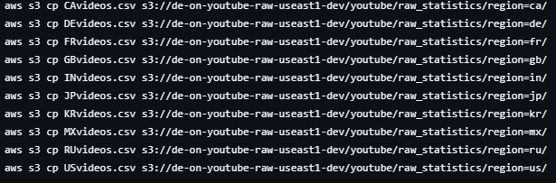
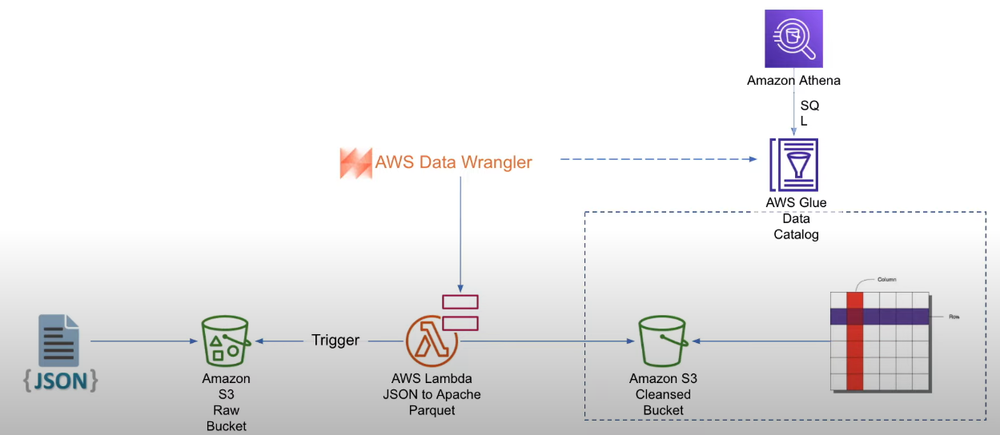
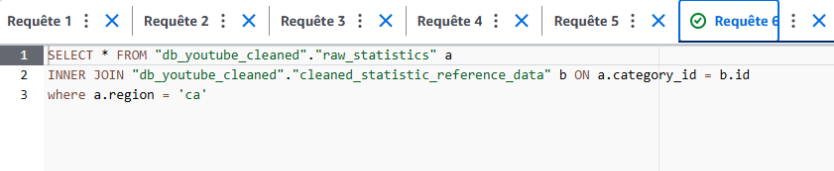
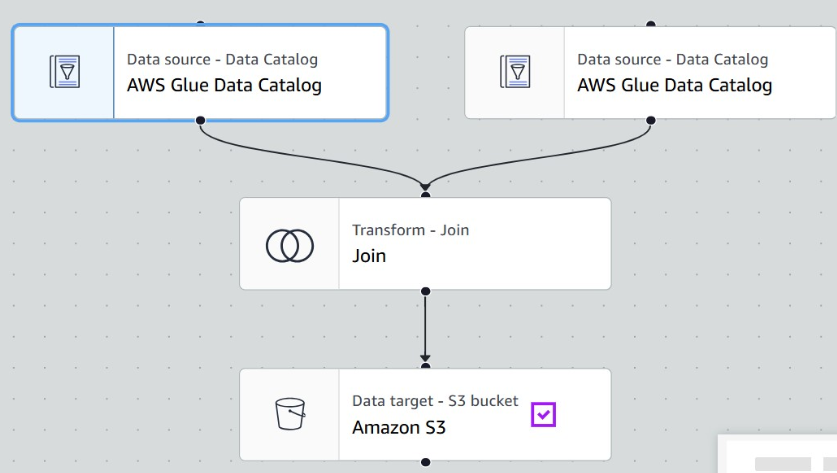
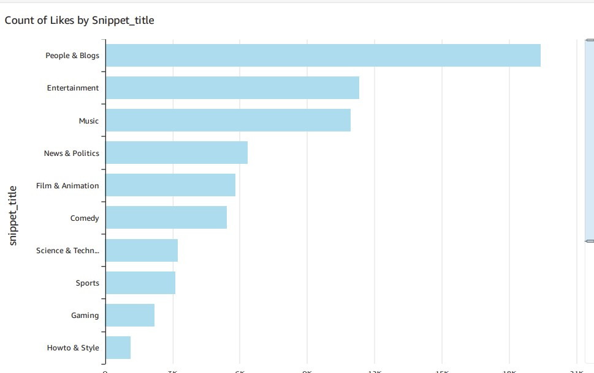
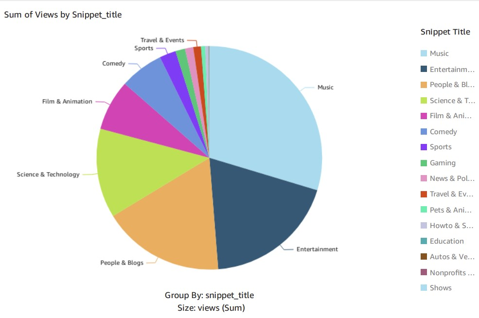
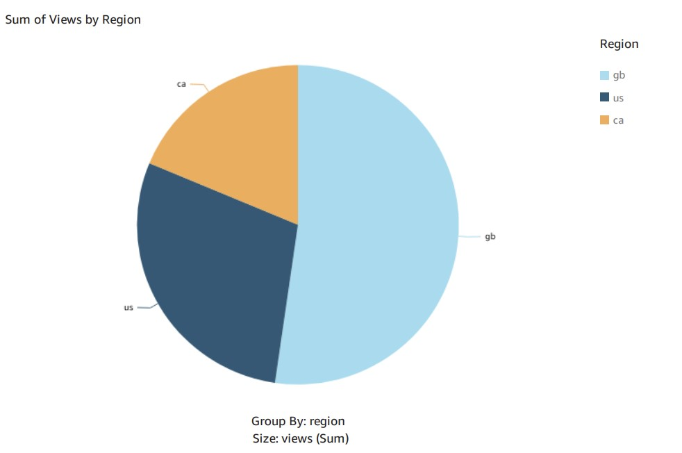

# 📊 Projet d'Analyse YouTube de Données  
**Par Assane Thiaw**  

## 🚀 Introduction  
Ce projet a pour objectif de collecter, structurer et analyser les données des vidéos YouTube afin de répondre à la question clé :  

> **Qu'est-ce qui rend une vidéo populaire ?**  

En exploitant des outils cloud et des techniques de data engineering, nous cherchons à identifier les tendances et les facteurs de succès des vidéos virales.  

---

## 🎯 Objectifs du Projet  
🔹 **Ingestion des Données** : Extraction et stockage des données de manière automatisée.  
🔹 **Évolutivité** : Un système capable de s’adapter à la croissance du dataset.  
🔹 **Utilisation du Cloud** : Exploitation des services AWS pour le traitement et l'analyse.  
🔹 **Reporting & Visualisation** : Création de tableaux de bord pour interpréter les résultats.  

---

## 📏 Métriques Clés  

### 📽️ Métriques liées aux vidéos  
Nous analysons plusieurs indicateurs pour mesurer la performance des vidéos :  

- **📈 Vues moyennes par vidéo** : Nombre moyen de vues obtenues par chaque vidéo.  
- **💬 Taux d'engagement** : `(likes + commentaires) / vues` → mesure l’interaction des utilisateurs.  
- **🌍 Top vidéos par région** : Identification des vidéos les plus populaires par pays.  
- **📅 Durée moyenne en tendance** : Nombre de jours moyen où une vidéo reste en tendances.  
- **📊 Distribution des catégories** : Répartition des vidéos par catégorie.  
- **👍 Ratio likes/dislikes** : Indicateur de la réception du contenu.  

---

## ☁️ Services AWS Utilisés  

| Service AWS   | Rôle dans le projet |
|--------------|--------------------|
| **Amazon S3** | Stockage des datasets bruts et transformés. |
| **AWS IAM** | Gestion des permissions et sécurité des accès. |
| **AWS Glue** | Workflows ETL pour la préparation et transformation des données. |
| **AWS Lambda** | Automatisation des traitements sans serveur. |
| **AWS Athena** | Interrogation SQL interactive des données sur S3. |
| **Amazon QuickSight** | Création de tableaux de bord interactifs pour la visualisation des analyses. |

---

## 📂 Jeu de Données  
Le dataset provient de [Kaggle](https://www.kaggle.com/datasets/datasnaek/youtube-new) et contient des statistiques quotidiennes sur les vidéos populaires de YouTube.  

### 🗃️ Principales Colonnes  
- **Titre de la vidéo**, **nom de la chaîne**, **heure de publication**  
- **Tags**, **nombre de vues**, **likes**, **dislikes**, **commentaires**  
- **Catégorie (JSON associé avec `category_id`)**  

Les fichiers JSON et CSV sont stockés séparément dans des **buckets S3** via des commandes adaptées :  

  
  

---

## 🏗️ Architecture du Projet  

Voici l'architecture globale mise en place :  

  

### 🔹 Workflow du traitement des données  
1️⃣ **Stockage des datasets bruts sur S3**  
2️⃣ **Transformation des données via AWS Glue ETL**  
3️⃣ **Création d’un catalogue de données avec AWS Glue Crawlers**  
4️⃣ **Requêtes SQL sur les données avec AWS Athena**  
5️⃣ **Optimisation et préparation pour l’analyse**  
6️⃣ **Visualisation des insights sur QuickSight**  

🔹 **Diagramme de transformation des données** :  
  

🔹 **Exemple de requêtes SQL sur Athena** :  
  

🔹 **Deuxième pipeline ETL pour optimisation** :  
  

---

## 📊 Résultats et Analyses  

### **1️⃣ Nombre de Likes par Catégorie**  
Ce graphique met en évidence les catégories générant le plus d’engagement :  
✅ **"People & Blogs" domine largement**, suivi de **"Entertainment" et "Music"**  
📉 **Les catégories "How-to & Style" et "Gaming" ont un engagement plus faible**  

  

### **2️⃣ Somme des Vues par Catégorie**  
Répartition des vues globales entre les différentes catégories :  
🎵 **"Music" est la catégorie qui attire le plus de vues.**  
🎭 **"Entertainment" arrive en deuxième position.**  
🔬 **Présence notable des catégories "Science & Technology" et "Film & Animation".**  

  

### **3️⃣ Somme des Vues par Région**  
Analyse de la répartition géographique des vues :  
🇬🇧 **Le Royaume-Uni représente la majorité des vues.**  
🇺🇸 **Les États-Unis occupent la seconde place.**  
🇨🇦 **Le Canada a la plus faible part des vues.**  

  

---

## 🔎 Synthèse et Insights  

🎯 **Ce que nous avons appris** :  
✔️ **Les catégories "People & Blogs" et "Music" dominent l’engagement.**  
✔️ **Le Royaume-Uni génère plus de vues que les États-Unis et le Canada.**  
✔️ **Les créateurs de contenu peuvent exploiter les niches comme "Science & Technology".**  

📌 **Opportunités pour les créateurs de contenu** :  
- Miser sur les **catégories les plus engageantes** (ex : "People & Blogs", "Music").  
- Adapter les vidéos aux **spécificités régionales**.  
- Explorer des **segments moins saturés** pour se démarquer.  

---

## 🛠️ Ressources et Code  

📂 **Retrouvez les scripts ETL et les fonctions AWS Lambda dans les fichiers fournis.**  
💻 **Pour toute question ou amélioration, n’hésitez pas à me contacter !**  

---
💡 _Projet réalisé par **Assane Thiaw**_  
